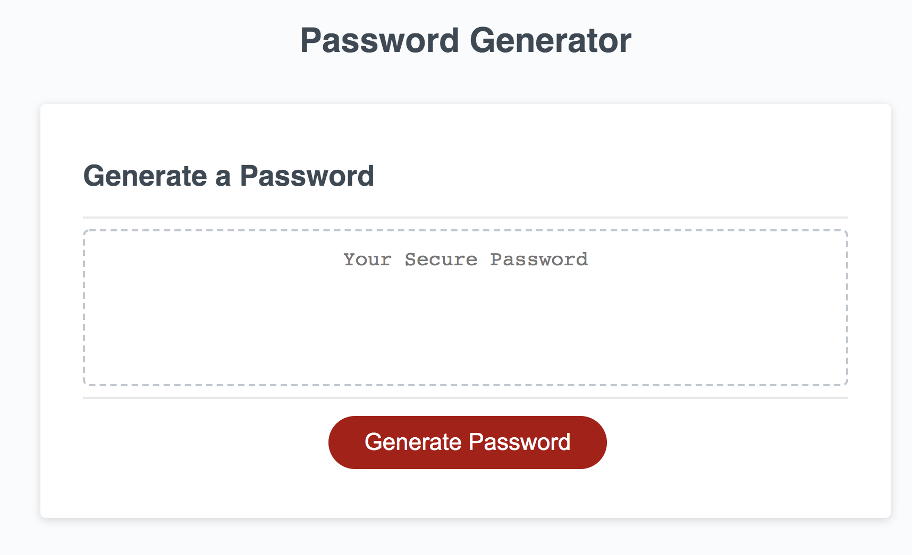

# Password-Generator
https://l-barrios.github.io/Password-Generator/
```
This is a password generator using Javascript.

User can chose a range between 8 - 128. 

User must select atleast one or all character types. 

The character types are lowercase letters, uppercase letters, special characters, and numbers. 

If none are selected a message prints out saying "undefined"

Once user wants to generate a new password it will over ride and and make them chose the options again.
```

